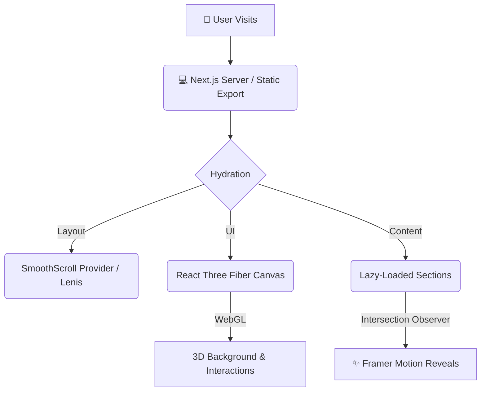

<div align="center">
  <h1>✨ Santhosh CV | Portfolio ✨</h1>
  <p><b>A premium, high-performance, 3D-integrated personal portfolio built for the modern web.</b></p>
  
  [](https://santhoshcv07.github.io/PORTFOLIO)
  
  []()
  []()
  []()
  []()
  []()
</div>

<br />

## 🎯 What It Is

This repository contains the source code for my personal portfolio. Designed to feel like a native desktop application, it combines cutting-edge web technologies to deliver an ultra-smooth, premium user experience. From inertia-based scrolling to hardware-accelerated 3D elements, every pixel is optimized for maximum performance and visual impact.

## 🚀 Key Features

- **🌊 Buttery Smooth Scrolling**: Powered by Lenis, the inertia-based scrolling engine makes navigating the site feel like gliding on water.
- **🧊 3D Integration**: Seamless integration of WebGL and Three.js (via React Three Fiber) for immersive, interactive background elements and physics.
- **⚡ Extreme Performance**: Deep-engine optimizations ensure a consistent 60–120 FPS. Uses strict React reconciliation tuning, static imports for blur placeholders, and explicit GPU composite layer promotions.
- **🎨 Premium Animations**: Highly polished, spring-eased reveal animations triggered via Intersection Observers using Framer Motion.
- **📱 Fully Responsive**: A flawless experience across desktop, tablet, and mobile devices, featuring a custom glassmorphic mobile navigation drawer.

## 📂 Detailed Folder Structure

```text
PORTFOLIO/
├── app/                       # Next.js 14 App Router (Pages, Layout, Globals)
├── components/                # Reusable React Components
│   ├── layout/                # Global layout elements (Navbar, Footer, Background, Lenis Scroll)
│   └── sections/              # Individual page sections (Hero, About, TechStack, Projects, etc.)
├── constants/                 # Static data and configurations
├── public/                    # Static assets (images, fonts, 3D models)
├── .env.local                 # Environment variables (EmailJS keys, etc.)
├── package.json               # Project dependencies
├── tailwind.config.ts         # Tailwind CSS configuration
└── tsconfig.json              # TypeScript configuration
```

## 🏗️ Architecture & Workflow

Here is a high-level overview of how the portfolio renders its highly optimized UI:



## 🛠️ Setup & Local Deployment

Running this portfolio locally is quick and easy. 

### Prerequisites
- Node.js (v18+)
- npm or yarn
- An EmailJS account (for the contact form)

### Installation Steps

1. Clone the repository:
   ```bash
   git clone https://github.com/Santhoshcv07/PORTFOLIO.git
   cd PORTFOLIO
   ```
2. Install dependencies:
   ```bash
   npm install
   ```
3. Set up environment variables:
   - Create a `.env.local` file in the root directory.
   - Add your EmailJS keys to enable the contact form:
     ```env
     NEXT_PUBLIC_EMAILJS_SERVICE_ID=your_service_id
     NEXT_PUBLIC_EMAILJS_CONTACT_TEMPLATE=your_template_id
     NEXT_PUBLIC_EMAILJS_AUTOREPLY_TEMPLATE=your_autoreply_template_id
     NEXT_PUBLIC_EMAILJS_PUBLIC_KEY=your_public_key
     ```
4. Start the development server:
   ```bash
   npm run dev
   ```
   *The portfolio will be running locally at `http://localhost:3000`*

## 🌟 Technologies Used

- **Framework**: [Next.js (App Router)](https://nextjs.org/)
- **Styling**: [Tailwind CSS](https://tailwindcss.com/)
- **Animations**: [Framer Motion](https://www.framer.com/motion/)
- **3D Engine**: [Three.js](https://threejs.org/) & [React Three Fiber](https://docs.pmnd.rs/react-three-fiber/getting-started/introduction)
- **Smooth Scrolling**: [Lenis](https://lenis.studiofreight.com/)
- **Icons**: [Lucide React](https://lucide.dev/) & [React Icons](https://react-icons.github.io/react-icons/)

## 🤝 Contribution

Feel free to fork this project to use as a template for your own portfolio! If you find any bugs or have suggestions for improvements, please open an issue or submit a pull request.

1. Fork the Project
2. Create your Feature Branch (`git checkout -b feature/AmazingFeature`)
3. Commit your Changes (`git commit -m 'Add some AmazingFeature'`)
4. Push to the Branch (`git push origin feature/AmazingFeature`)
5. Open a Pull Request

---
<div align="center">
  <p>Built with ❤️ by <a href="https://github.com/Santhoshcv07">Santhosh CV</a></p>
</div>
